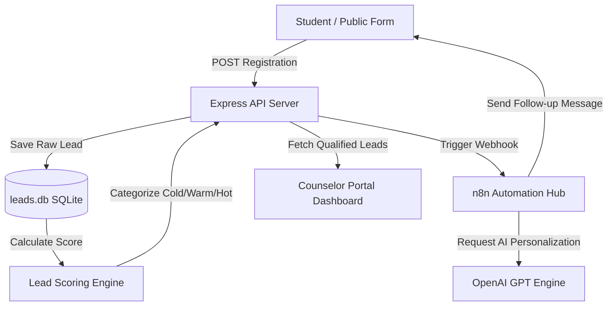

# EFOS AI: Powered Lead Qualification & Nurturing System

EFOS AI is an intelligent, end-to-end lead management platform designed to automate student registration, qualify inquiries using a dynamic scoring engine, route high-value prospects, and run multi-day automated follow-up sequences.

---

## 🌟 Core System Features

### 1. 🔑 Counselor Portal (Secure Login)
* **OTP Verification**: Secure 2-step passwordless login using counselor email and dynamic OTP generation.
* **Paste Support**: Inputs support copy-pasting 6-digit codes directly with instant auto-focus mapping.
* **Ambient UI**: Glassmorphic dashboard card overlaying drifting ambient purple and violet glow blobs.

### 2. 📊 Counselor Control Panel (Dashboard)
* **Real-Time Data**: List, search, filter, and sort student registrations instantaneously.
* **Lead Qualification Badges**: Color-coded categorization (`Hot` in green, `Warm` in amber, `Cold` in gray) indicating conversion probability.
* **Instant Action**: Counselors can manually adjust lead status dropdowns (`Contacted`, `Qualified`, `Rejected`, `Enrolled`, `Pending Review`) which updates the DB instantly.

### 3. 🤖 AI-Powered Scoring Engine
Qualifies leads in the background upon registration using customizable weights (`scoringRules.json`):
* **Qualification Match**: Leads with higher education (e.g. `12th Completed`) get **+20 points**.
* **Target Age Group**: Core demographics (Ages `16-18`) receive **+25 points**.
* **Intent Indicators**: Downloading the program brochure adds **+15 points**, and having **>3 website visits** yields **+20 points**.
* **Auto-Category Routing**:
  * **0 - 40**: `Cold`
  * **41 - 70**: `Warm`
  * **71 - 100**: `Hot` (Triggers immediate counselor routing)

### 4. ✉️ Automated follow-up (n8n Workflow Engine)
* **Webhook Integration**: Real-time webhook triggers n8n follow-ups upon student registration.
* **Multi-Step Campaign**: Automatically sequences message outreach (Day 1: Welcome, Day 3: Details, Day 5: Stories, Day 7: Reminders).
* **AI Message Customization**: Generates personalized emails/texts using OpenAI's API.
* **Auto-Reject**: Automatically tags unresponsive leads as "Rejected" after Day 10.

---

## 🏗️ System Architecture



---

## 🛠️ Technology Stack

| Layer | Technologies |
| :--- | :--- |
| **Frontend** | React, React Router Dom, Axios, CSS Transitions |
| **Backend** | Node.js, Express, SQLite3 |
| **Automation** | n8n, OpenAI API |
| **Branding & Design** | Vector SVG Icons, Outfit Typography, Glassmorphism CSS |

---

## 🚀 Local Quickstart Guide

### 1. Prerequisites
Ensure you have **Node.js (v16+)** and **Python (v3+)** installed.

### 2. Backend Installation & Start
1. Navigate to the backend directory:
   ```bash
   cd backend
   ```
2. Copy the example environment file and add your credentials:
   ```bash
   copy .env.example .env
   ```
3. Run the development server (starts on `http://localhost:5000`):
   ```bash
   npm install
   npm run dev
   ```

### 3. Frontend Installation & Start
1. Navigate to the frontend directory:
   ```bash
   cd ../frontend
   ```
2. Start the React development server (starts on `http://localhost:3000`):
   ```bash
   npm install
   npm start
   ```

### 4. Bulk Mock Data Import
To populate the SQLite database with 1000 dynamically scored mock student leads and create a `.csv` datasheet:
```bash
cd ..
python import_leads.py
```

---

## 🔌 API Endpoints Reference

* `GET /api/health` — API health check indicator
* `GET /api/leads` — Fetch leads list (supports search, sort, filter, and pagination query params)
* `POST /api/leads` — Submit a student registration
* `PUT /api/leads/:id` — Update lead profile or pipeline status
* `GET /api/leads/:id/score` — View full lead score criteria breakdown
* `GET /api/analytics` — Fetch key conversion funnel statistics
